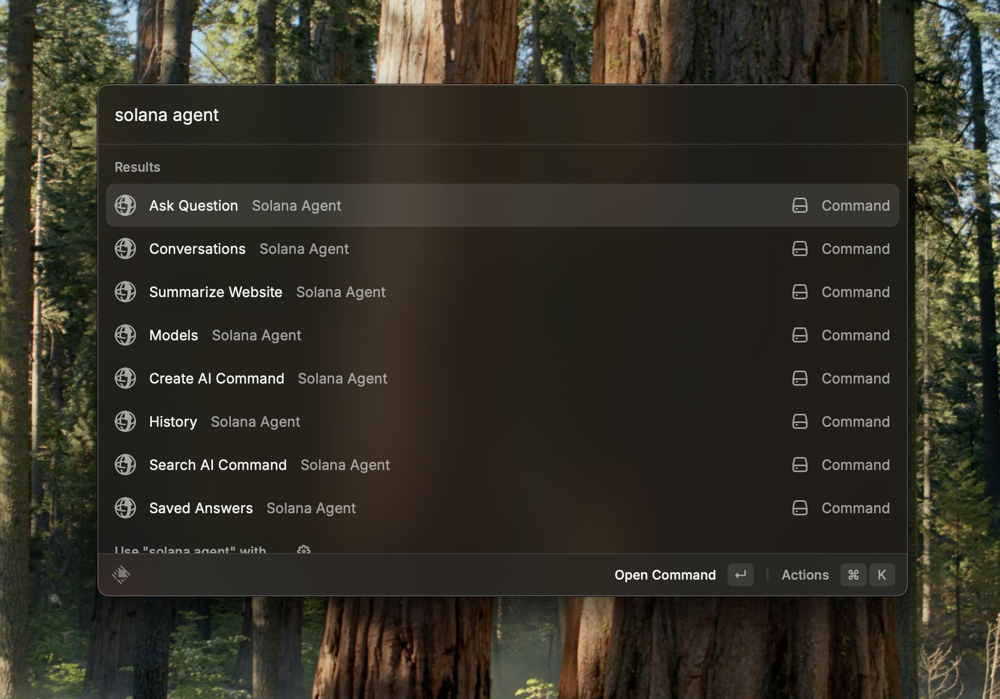

<h1 align="center">SendAI</h1>

<h3 align="center">
Interact with the Solana blockchain from Raycast using AI
</h3>

# Overview

SendAI is a Raycast extension that allows you to interact with the Solana blockchain using natural language commands. Manage your wallet, trade tokens, check portfolios, and perform various DeFi operations directly from Raycast.

# Commands

## Trading & Wallet Management

- **Buy Token** - Purchase tokens using SOL
- **Sell Token** - Sell your tokens for SOL
- **Transfer SPL** - Transfer SPL tokens to another wallet address
- **Get Wallet** - View your SendAI wallet information
- **Get Portfolio** - View your complete token portfolio

## Token Information

- **Token Overview** - Get detailed information about any token
- **Trending Tokens** - View the current trending tokens on Solana

## Advanced Trading

- **Create DCA** - Set up Dollar Cost Averaging orders
- **Create Limit Order** - Create limit orders for trading
- **Show Limit Orders** - View all your active limit orders
- **Show DCA Orders** - View all your active DCA orders

# AI Actions

The extension includes powerful AI actions that you can trigger with natural language:

## Balance & Portfolio

- **Balance** - Check your SOL balance
- **Get SOL Balance** - Get your SOL balance specifically
- **Get Token Balance** - Check balances of all your tokens
- **Get Portfolio** - View your complete portfolio with USD values

## Trading Operations

- **Buy Token** - Buy tokens using SOL with natural language
- **Sell Token** - Sell tokens for SOL
- **Fetch Price** - Get current token prices in USDC
- **Get Price History** - View token price charts and history

## Transfers

- **Transfer** - Send SOL to another wallet address
- **Transfer SPL** - Transfer SPL tokens to another address
- **Get Wallet Address** - Get your wallet's public key

## Token Information

- **Get Token** - Get comprehensive token information
- **Get Token Data by Ticker** - Look up tokens by their symbol/ticker
- **Get Trending Tokens** - Fetch currently trending tokens
- **Rugcheck** - Check if a token is potentially a rug pull

## DeFi & Advanced Features

- **Bridge** - Generate cross-chain bridge URLs
- **Onramp** - Create MoonPay URLs to buy SOL with fiat
- **Get Top LST** - View top Liquid Staking Tokens
- **Lulo Get APY** - Check APY rates on Lulo protocol
- **Lulo Lend** - Lend tokens through Lulo protocol
- **Sanctum Get LST APY** - Get LST APY rates on Sanctum

## Token Creation

- **Launch Pump Fun Token** - Create and launch new tokens on Pump.fun

# Usage Examples

Simply type natural language commands to interact with your Solana wallet:

- "Buy 10 SEND tokens"
- "What's my SOL balance?"
- "Show me trending tokens"
- "Transfer 5 USDC to [wallet-address]"
- "What's the price history of SOL?"
- "Check if this token is safe"

# Setup

Just install the extension, login with google and start using the it.

---

Made by the SendAI team

